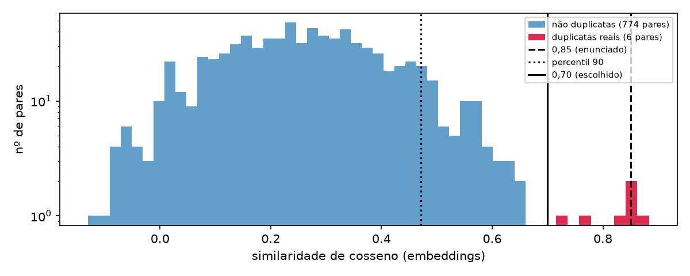
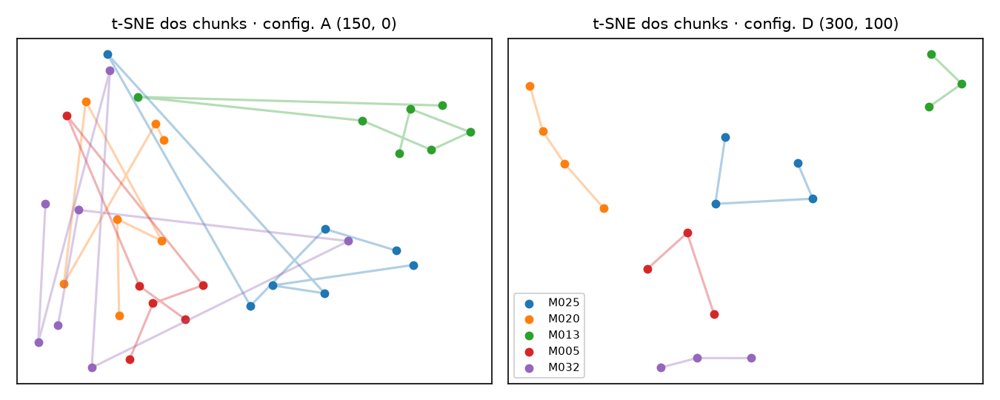

# Ouvidoria Inteligente — Relatório Final

Triagem semântica de manifestações cidadãs · Tendências em Ciência da Computação · Prof. Me. Ricardo Roberto de Lima · **Autor:** Victor (entrega individual) · 28/09/2026.

## 1. Visão geral

A ouvidoria faz a triagem por palavras-chave e por isso não detecta duplicatas, não agrupa temas relacionados e perde contexto em relatos longos. O protótipo troca as palavras-chave por representações vetoriais. Todas as entregas usam o mesmo módulo (`ouvidoria.py`) e os mesmos dados.

| Entrega | Decisão principal | Resultado |
|---|---|---|
| 1. Representações | embeddings multilíngues contra BoW e TF-IDF | só os embeddings separam duplicatas de temas diferentes |
| 2. Duplicatas | limiar 0,70 em vez de 0,85 | 6 de 6 duplicatas, nenhum falso positivo |
| 3. Chunking | chunks de 300 caracteres com 100 de overlap | nenhum fragmento; 88% dos chunks apontam para a própria denúncia |
| 4. App Streamlit | 4 abas, cache do modelo, modelo e top-k na barra lateral | busca por significado, matriz, espaço vetorial e chunking |

Arquivos: `análise_comparativa.ipynb`, `deteccao_duplicatas.ipynb`, `chunking_manifestacoes.ipynb` e `app_ouvidoria.py`.

## 2. Dados

O enunciado diz que o `manifestacoes.json` é fornecido, mas nesta turma cada aluno monta o seu. **Decisões:** 40 manifestações no esquema da seção 2 (id, data, categoria oficial e texto de 116 a 682 caracteres), nas categorias infraestrutura (9), saúde (8), segurança (8), educação (8), meio ambiente (7). Há 6 pares de duplicatas semânticas (15%), escritos com vocabulário diferente, e 5 relatos com mais de 500 caracteres. Os trechos citados nos pares da Entrega 1 aparecem dentro de relatos completos, porque sozinhos ficariam abaixo do mínimo de 50 caracteres. O esquema não tem campo que marque duplicatas, então o gabarito ficou num arquivo à parte (`duplicatas_reais.json`).

## 3. Entrega 1 — representações

**Decisões:** BoW (`CountVectorizer`) e TF-IDF (`TfidfVectorizer`) com uma lista de stopwords em português, porque o scikit-learn só traz a lista em inglês. Para os embeddings, `paraphrase-multilingual-MiniLM-L12-v2`, o primeiro modelo sugerido; o segundo, `BAAI/bge-small-pt-v1.5`, não existe no Hugging Face.

| Par | BoW | TF-IDF | Embeddings |
|---|---|---|---|
| M003 × M017 (mesmo buraco) | 0,143 | 0,133 | 0,715 |
| M008 × M022 (mesmo posto sem médico) | 0,167 | 0,159 | 0,848 |
| M008 × M031 (temas diferentes) | 0 | 0 | 0,225 |

Nas representações esparsas, os pares duplicados só têm em comum nomes próprios (“Sete de Setembro”, “São José”) e ficam quase tão distantes quanto o par sem relação. Os embeddings dão 0,715 e 0,848 às duplicatas e 0,225 ao par de temas diferentes. **Limitações:** BoW e TF-IDF não veem sinônimos nem paráfrases; os embeddings não explicam a nota e dependem do modelo (e do idioma em que ele foi treinado).

## 4. Entrega 2 — duplicatas

**Decisões:** `detectar_duplicatas(textos, limiar=0.85)` mantém o padrão pedido, compara com “acima do limiar” (`>`) e devolve todos os pares i < j. O limiar foi escolhido por uma varredura de 0,50 a 0,90 contra o gabarito, incluindo o percentil 90 sugerido na seção 7.

| Limiar | Detectadas (de 6) | Falsos positivos | Precisão | Revocação |
|---|---|---|---|---|
| 0,85 (padrão do enunciado) | 1 | 0 | 1 | 0,17 |
| 0,471 (percentil 90) | 6 | 72 | 0,08 | 1 |
| 0,70 (escolhido) | 6 | 0 | 1 | 1 |

A menor duplicata real tem 0,715 e a maior não duplicata tem 0,660: 0,70 fica entre as duas. O 0,85 perde paráfrases com vocabulário diferente (“vender drogas” × “tráfico de drogas”). O percentil 90 marca por construção 10% dos pares e confunde “mesmo tema” com “mesmo problema”. Como a folga é estreita e o limiar foi calibrado em 40 manifestações, a recomendação é usar a detecção para **sugerir** duplicatas a um atendente, sem fundir manifestações automaticamente.

## 5. Entrega 3 — chunking

**Decisões:** `RecursiveCharacterTextSplitter` com separadores parágrafo → linha → frase → palavra, e quatro configurações: dois tamanhos, cada um com e sem overlap, para isolar o efeito do overlap. Além de exemplos, três medidas: fragmentos, coesão entre chunks consecutivos e se o chunk sozinho ainda aponta para a própria manifestação entre as 40.

| Config. | Chunks | Fragmentos | Coesão consecutiva | Recupera a origem | Vizinho da mesma manifestação |
|---|---|---|---|---|---|
| A (150, 0) | 34 | 10 | 0,223 | 0,74 | 0,59 |
| B (150, 50) | 34 | 10 | 0,288 | 0,74 | 0,62 |
| C (300, 0) | 15 | 0 | 0,48 | 0,87 | 0,73 |
| D (300, 100) | 17 | 0 | 0,597 | 0,88 | 0,82 |

O overlap aumentou a coesão nos dois tamanhos, mas o splitter repete **pedaços inteiros** (frases, ou palavras quando a frase foi quebrada), e não uma janela de caracteres. Com `chunk_size` 250, overlap 0 e 60 geram os mesmos chunks. A configuração D preserva melhor o sentido: cada chunk tem de 2 a 3 frases completas. Com chunks de uma frase, surgem fragmentos como “estavam no trabalho.”, e os chunks passam a se agrupar pelo assunto da frase (burocracia, danos à saúde), não pela denúncia.

## 6. Entrega 4 — app Streamlit

**Arquitetura:** `app_ouvidoria.py` separa a lógica (ranking, projeção 2D, comparação com as categorias, chunking) da interface (`main()`) e reaproveita o `ouvidoria.py`. O modelo fica em `st.cache_resource`, e os embeddings, as projeções e as métricas em `st.cache_data`. A barra lateral escolhe o modelo (multilíngue ou `all-MiniLM-L6-v2`, para comparação) e o top-k, com padrão 5. As abas são Busca Semântica (score em verde acima de 0,7, amarelo acima de 0,5 e vermelho nos demais), Base Completa (tabela e botão da matriz), Espaço Vetorial (PCA ou t-SNE por categoria) e Chunking (estratégia, `chunk_size` e `chunk_overlap`, com padrão 300/100 vindo da Entrega 3).

**Os clusters coincidem com as categorias? Em parte.** Com o modelo multilíngue, 70% das manifestações têm como vizinho mais próximo uma da mesma categoria, e o K-Means com 5 grupos tem ARI 0,49 e pureza 75%. Saúde forma um grupo puro e completo. Infraestrutura e meio ambiente se misturam, porque o embedding agrupa pelo cenário (rua, trânsito, água e lixo), enquanto a categoria é administrativa. Com o `all-MiniLM-L6-v2`, treinado só em inglês, os números caem para 57% e ARI 0,31. Na aba Espaço Vetorial, as métricas são calculadas no espaço original: o PCA com 2 componentes guarda só 25% da variância.

## 7. Dificuldades

- **Montar os dados.** As duplicatas não podiam ser cópias literais, porque aí até o BoW as acharia, e os relatos longos tinham de caber em 800 caracteres com várias frases.
- **O limiar do enunciado.** Com 0,85 o detector achava 1 duplicata de 6. Foi preciso um gabarito e uma varredura para escolher outro limiar, e a folga entre as classes é pequena.
- **O overlap que “não fazia nada”.** As configurações (250, 0) e (250, 60) davam chunks idênticos. Entender o motivo exigiu ler como o splitter monta o overlap com pedaços inteiros.
- **Projeções 2D enganam.** O PCA sobrepõe grupos que estão separados em 384 dimensões. As conclusões passaram a se apoiar em medidas no espaço original, e a figura virou só ilustração.
- **Peso dos modelos.** O modelo multilíngue tem ≈ 470 MB e a primeira carga é lenta. O cache do Streamlit resolveu o uso normal, e um modo sem rede (`OUVIDORIA_EMBEDDER=falso`, com um embedder determinístico local) permitiu desenvolver a interface sem baixar o modelo.

## 8. Aprendizados

- **Esparso × denso.** Contar palavras funciona quando os textos dividem vocabulário. Para paráfrases, só as representações densas aproximam os textos certos.
- **Limiar é calibração, não constante.** Ele depende do modelo e dos dados, precisa de gabarito e deve alimentar uma decisão humana.
- **No chunking, o tamanho importa mais que o overlap.** Um chunk precisa carregar o sujeito da denúncia. O overlap ajuda na continuidade, mas não salva um chunk pequeno demais e custa texto repetido no índice.
- **Similaridade semântica ≠ categoria administrativa.** Os embeddings servem para sugerir a categoria e achar temas relacionados, mas não substituem a classificação oficial.
- **Medir antes de afirmar.** Cada conclusão das entregas veio acompanhada do número que a sustenta, e este relatório recalcula esses números a partir do código.
